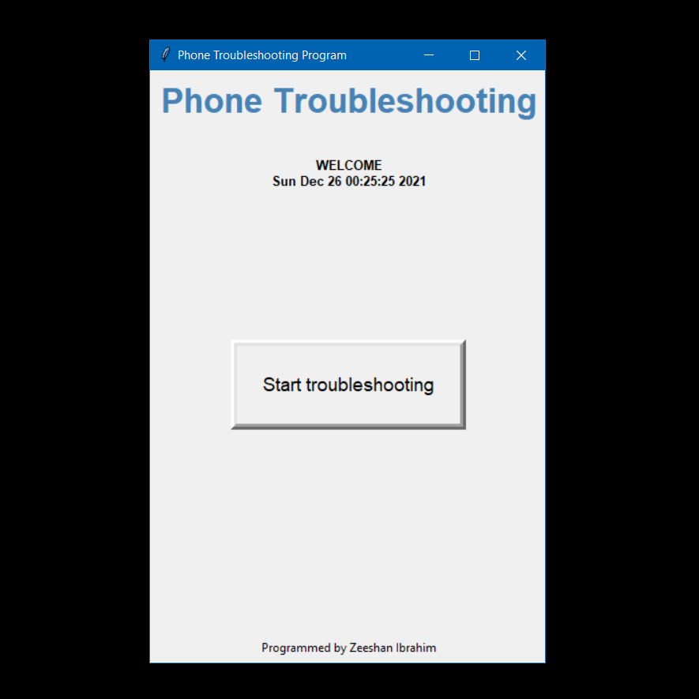
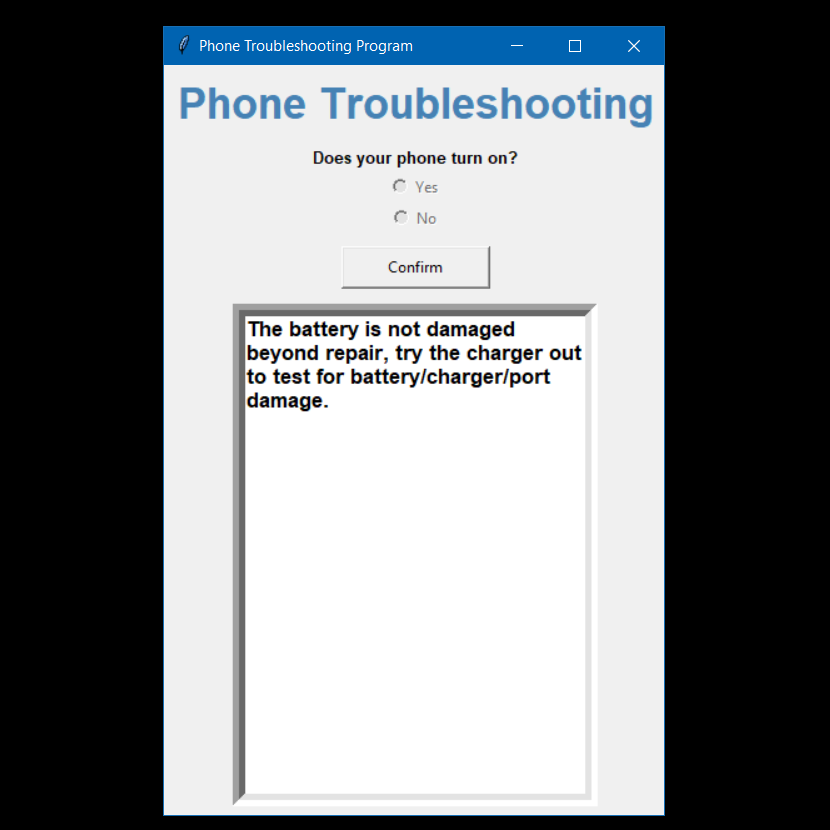
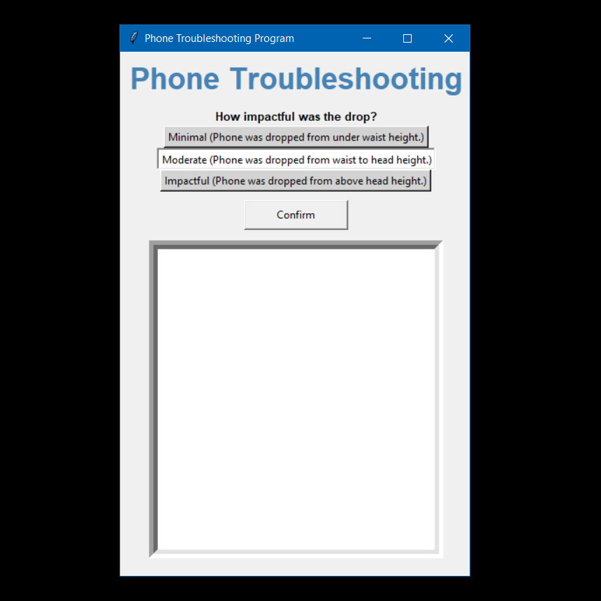
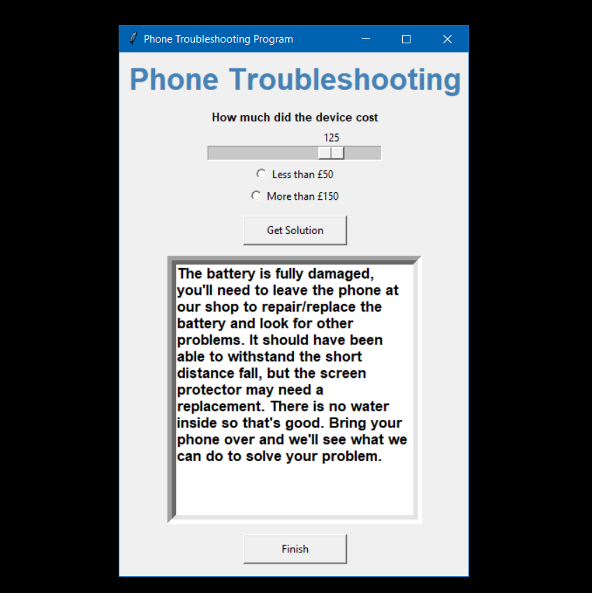
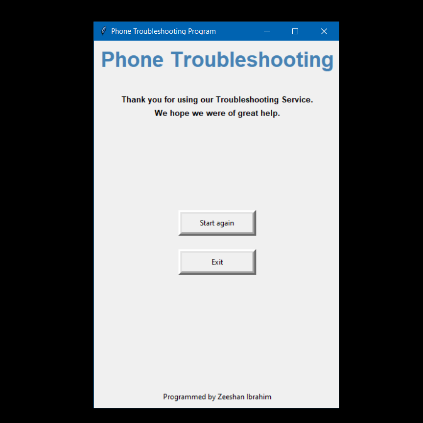

# Phone Troubleshooting Program
> Simple school project - to make a program for a tech company that the users use when their phone is broken.
> 
> Tutorial coming soon!
>
> The code for this project hasn't been uploaded yet but it will be soon.

## Table of Contents
* [Features](#features)
* [Screenshots](#screenshots)
* [Setup](#setup)
* [Project Status](#project-status)
* [Room for Improvement](#room-for-improvement)
* [Acknowledgements & Tutorial](#acknowledgements)
* [Contact](#contact)

## Features
- GUI with tkinter.
- Asks the user questions on consecutive pages using different tkinter widgets to achieve a variety of inputs from the user.
- Stores and assesses the users responses to generate a solution.
- Takes into account specific features/criteria in order to come up with a suitable response.

## Screenshots
- Here are some screenshots of a few pages from the program.

## Setup
No installations needed. Only preinstalled modules are used.

## Project Status
Project is: _complete_.

## Room for Improvement
There are loads of ways one could improve this project - it was done in a short amount of time for school.

## Acknowledgements
Credits
- This project was created by Zeeshan Ibrahim (CodeZee)
- [Here](https://www.example.com) is the tutorial for the project.

## Contact
Created by [@CodeZee](https://www.example.com) - feel free to contact me!
